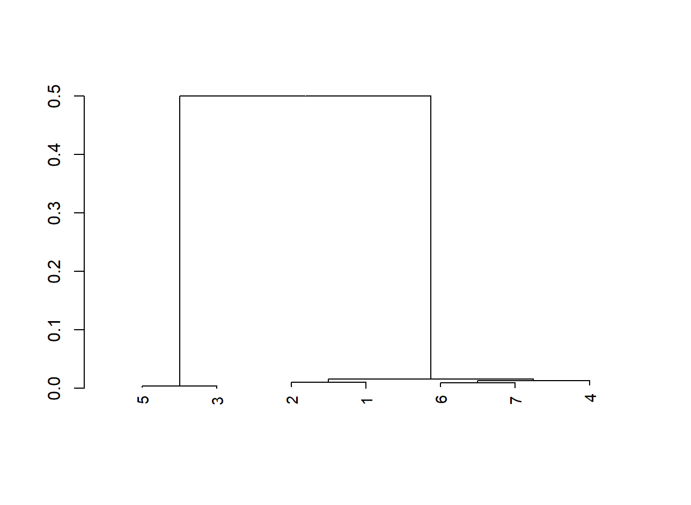

# BIO-410-Final-Project
## Background
The data consist of six samples from the organism Zaire ebolavirus. This organism is a virus which ______. (Kadanali et al., 2015)

Citation: 
Kadanali, A., & Karagoz, G. (2015). An overview of Ebola virus disease. Northern clinics of Istanbul, 2(1), 81–86. https://doi.org/10.14744/nci.2015.97269

## Purpose
The purpose of this project was to create a phylogenic tree from 6 samples of Zaire ebolavirus in order to determine  the evolutionary relationships between the samples.

## Methods
include information about
- Next-Generation Sequencing (NGS): the samples were sequenceed using NGS to generate ___ sequence data. Raw sequencing reads for each sample are provided in the repository as .fq files. As they contain the original unprocessed reads.
- Assembly using MEGAHIT (provide link to megahit website): raw sequencied were assembled into contigs using MEGAHIT. This is designed for assembling large and complex datasets for each sample.
- Alignment using R package DECIPHER: multiple alignemnt was preformed un R using DECIPHER, the contig sequences generated from the assembly setp and imported into R and aligned. The alignment identified homologus regions among the seqences and prepares data for phylogenetic analysis.
- Tree using ML in R package DECIPHER: the phylogenetic relationships among the sequences used maximum likelihood (ML). The aligned sequences were generated during the DECIPHER alignment and used to construct the ML phylogenetic tree. This tree evaluates the evolutionary relationships and sequences similarity among the 6 samples. The assembles sequence dataset are provided in the repository as .fq file.

## Results
Here is the phylogenetic tree:
(insert image, see the markdown cheatsheet) 
	
	
Explain:
The phylogenetic tree analysis showed revealed two lineages of the Ebola virus. Samples 1,2,4,6,7 are clustered together, indicating high genetic similarity and suggesting they originated from a closley realted lineage. In contrast, samples 3 and 5 show a greater evolutionary distance from the other samples. The pattern indicates a high sequence similarity and close evolutionary relatedness among these Zaire ebolavirus isolates.
